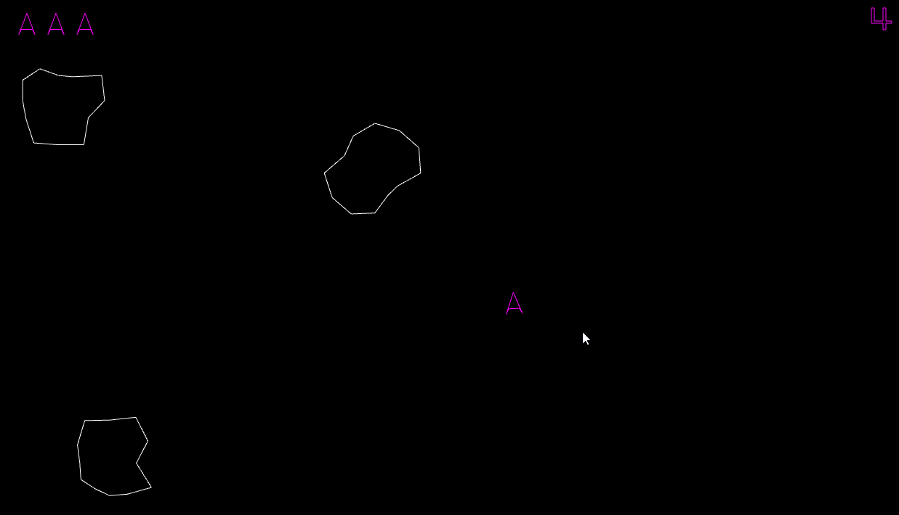
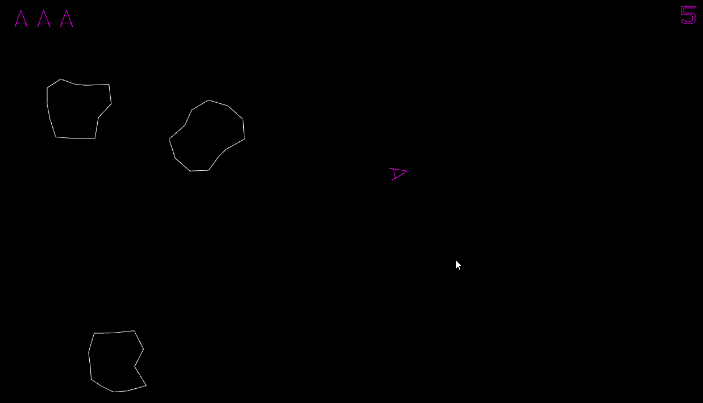
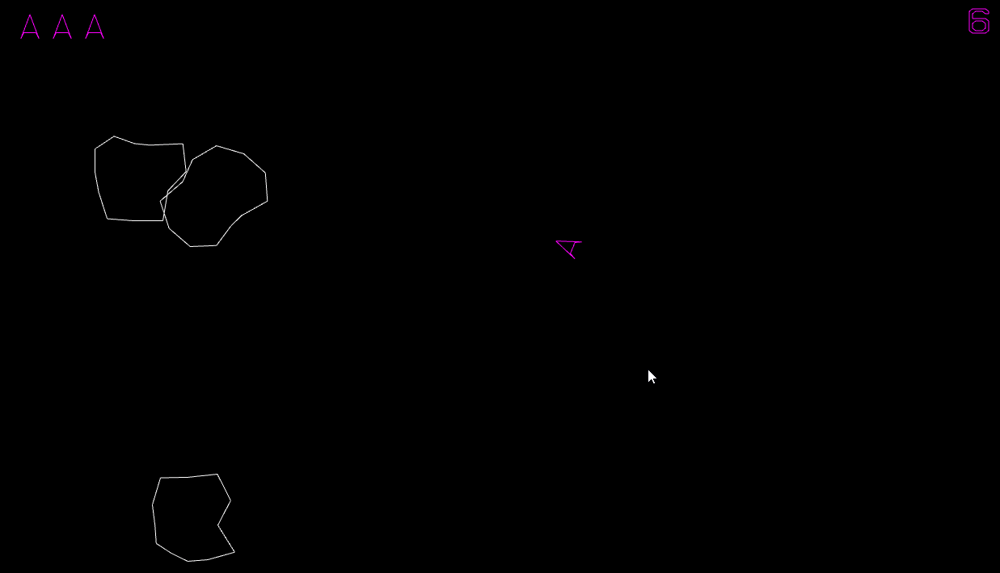
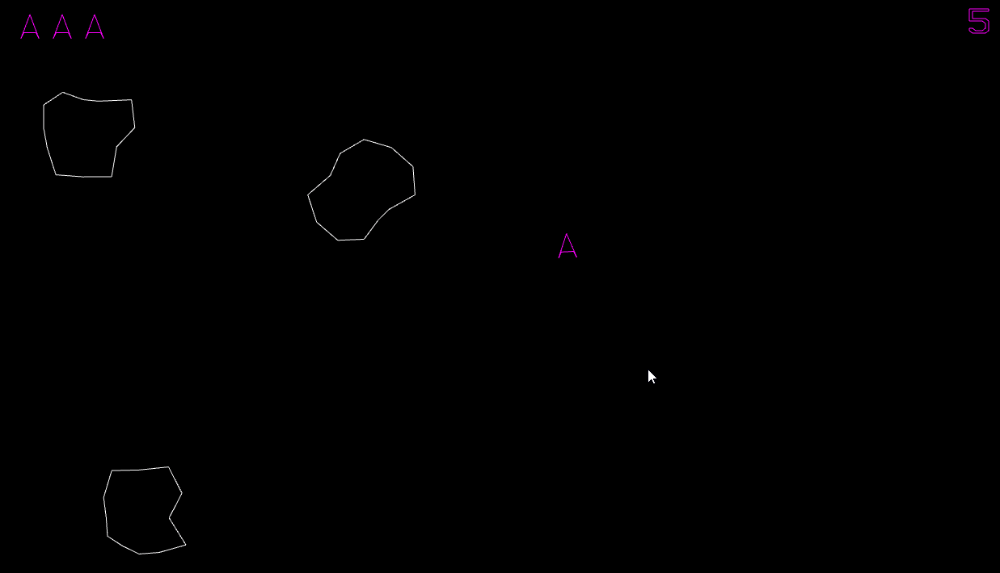
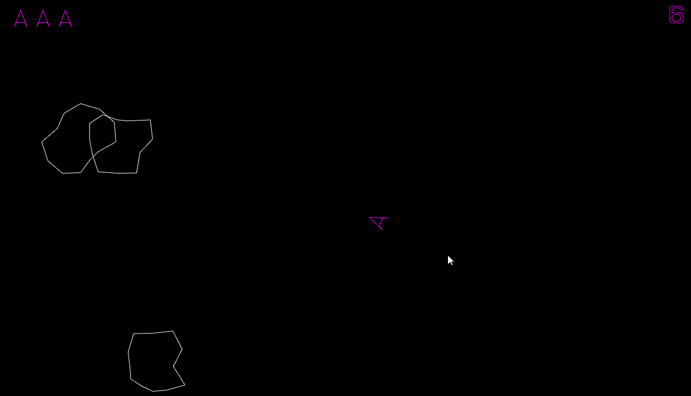

# This repo will contain the HTML implementation of the Atari game Asteroids

This game will be written by Dakota Turk and Harrison Walker

## Goals

The goal of the game is pretty straight forward, the player is a small triangular space ship that flies around space avoiding fast and slow moving asteroids. In order to evade the asteroids, the player can shoot them down with their built on cannon, navigate out of their path of destruction or jump into hyper space and attempt a dodge in doing so.

The main objective of this game is to survive. There is no score limit, nor level limit. Upon clearing the level, a new set of asteroids will spawn where one more than what started on the previous level will spawn with a max up to 10. The only way for the player to win, is to simply never lose. They are stuck in a never ending cycle of asteroids constantly trying to destroy them. That is, until their score limit hits the javascript max value which would likely break the entire game.

## Controls

The controls of the game will likely be very simple. A brief example:

W - Move Forward 
A - Turn Left 
S - Hyperspace Jump 
D - Turn Right 
Space - Shoot 

## Implementation

The implementation of this game is broken up into a few files: asteroid.js, bullet.js and player.js are all javascript files containing the asteroid, bullet and player classes. These are all used in the game.js to play the game which is implemented in the asteroids.html file. The menu.js script is used to manage the main menu scene which is implemented in the menu.html file.

The player can start the experience by first cloning this repo: <https://github.com/dturk0610/asteroids.git> Then navigate to the menu.html file found in [Asteroids/menu.html](/Asteroids/menu.html). Opening this file in your browser should show the main menu:

All testing has happened on the Microsoft Edge, Safari and Google Chrome. Chrome and Edge seem to perform the best, however. This testing was not done extensively by any manner, but the browser choosen will likely make an impact on performance.

When clicking within the Start box the title and box will highlight white to let the player know that they are infact about to enter the game. However, if the player would like to continue admiring the main menu, while holding their click down they can move away from the start box and left go of their click, making the title and box turn purple again. This type of interaction can later be seen when clicking on the game over box. This game over will be shown upon the player losing all of their lives:

### Asteroids

Each asteroid has a center, a velocity, a magnitude, a size and an array containing the vertices. The center, velocity and vertices are all randomly generated. The momentum is calculated using the area of the asteroid and the velocity of the asteroid, however this is not used yet. Finally the size value represents which stage the asteroid is in. 3 being the largest and initialized value, 2 being the mid sized asteroid and 1 being the last level before complete destruction of the asteroid.

To create a brand new asteroid, first a random position on the screen is picked to be the center. Next, 12 points evenly rotated around the center are generated at random radius from the center. Finally, a random velocity vector is also generated. After, each asteroid within a radius is pushed slightly away from the player so that they do not immediatley crash into the player and kill them. When an asteroid is broken, two asteroids are generated at the same position as the parent asteroid but with a smaller radius and different velocity vector (about 45 degrees off the original direction with a slight noise value so that the next level direction velocity vectors don't perfectly match).

### Player

The player is a triangular shaped space ship

The controls to move the player around are consistent with as stated above. W to move forward, A and D to turn left or right respectively and S to jump into hyper space. The player spawns in the center of the screen and is required to dodge incomming asteroids as they fly through space. They can use the space key to shoot them down. There is no cap on bullets, however, there is a cool down for their cannon. There is a time period between each bullet that the player can't shoot, during this small time period, the player will need to do evasive maneuvers in order to survive the incomming asteroids.

#### Lives

The player has 3 lives. You loose one when you collide with an asteroid. The lives are shown at the top right of the screen using 3 player models.

### Score

Score is shown in the top right of the web page. All numerics and phonetic characters seen throughout the entire game cann all be found in the characters.js file as a list of vertex per character. The score for the player increases as time progresses, awarding them for the length of time they have survived. The score also increases every time the player successfully shoots an asteroid. Surviving increases the player's score by one, and shooting an asteroid will increase the player's score by 10 for every asteroid hit.

### Sound

- Shooting:

<https://user-images.githubusercontent.com/50917856/157999802-10226408-f982-4d8c-b654-e8804d35f545.mp4>

- Player death:

<https://user-images.githubusercontent.com/50917856/157999813-7baeeffb-1563-4055-9e4c-11c2863e20c6.mp4>

- Asteroid explode:

<https://user-images.githubusercontent.com/50917856/157999819-19c34326-1f8d-49ff-9ac0-26172e32891e.mp4>

We do not claim to own this game or any of its intellectual property (if any) we simply are making this game for our Computer Graphics course.
